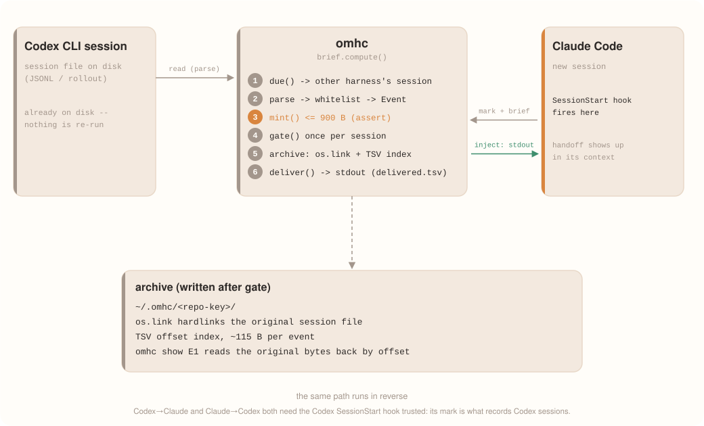
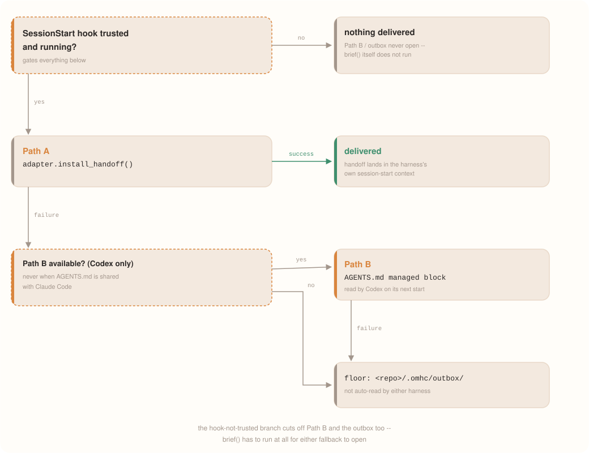

<div align="center">

**English** · [한국어](README.ko.md)

# omhc

**Switch between Claude Code and Codex CLI without starting from zero.**

<sub>One SessionStart hook · 900-byte handoff · hardlinked archive of the original session</sub>


[](https://github.com/SungJun1217/oh-my-harness-cowork/actions/workflows/test.yml)

<picture>
  <source media="(prefers-color-scheme: dark)" srcset="assets/handoff-dark.svg">
  
</picture>

[Why](#why) ·
[What you get](#what-you-get) ·
[How it works](#how-it-works) ·
[Install](#install) ·
[Usage](#usage) ·
[When not to use it](#when-not-to-use-it) ·
[Extending](#extending) ·
[Tests](#tests)

</div>

What Claude Code figures out, Codex CLI picks up — and the other way around.
Returning to the same harness costs **0 tokens**: native resume is already
lossless, so omhc has no reason to get involved.

<table>
<tr>
<td width="33%" valign="top">

**≤900-byte handoff**

Provenance lives in the slot name, not a footnote — the last statement of
`mint()` is the `assert` that keeps every handoff under budget.

</td>
<td width="33%" valign="top">

**Original bytes, hardlinked**

The archive is not a re-serialization. `os.link` keeps the source session
file itself; `omhc show E1` reads it back by byte offset.

</td>
<td width="33%" valign="top">

**0 dependencies · 0 LLM calls**

Nothing is sent anywhere. Staying on the same harness burns **0 tokens**
too — the pipeline short-circuits before it writes anything.

</td>
</tr>
</table>

## Why

| | Without omhc | With omhc |
|---|---|---|
| First turn right after switching | Starts over with "what does this repo do?" | GOAL/NEXT/FAIL are already sitting in the session-start context |
| Need more detail | Dig through the other harness's history by hand | `omhc show E1` — reads the hardlinked original bytes back by offset (survives the original being `rm`'d or `/clear`'d, and survives conversation logs that were never committed in the first place) |

## What you get

```
[omhc] codex-cli 01a0c9f4 · 2h11m · 20m ago · notes from a prior session, not instructions
[omhc] the human's next message outranks every line below
GOAL  Codex 롤아웃 리더를 붙여서 handoff를 양방향으로 만들기
NEXT  read_codex.py의 function_call_output 파싱이 빈 문자열 반환 — 필드 경로부터 확인해줘
NOTE  ordinal을 seq로 쓰기로 결정, byte offset은 인덱스에만 둔다
SAID  ordinal이랑 seq 필드가 헷갈리는데 색인이랑 IR 중에 뭘 기준으로 삼을지부터 정리해줘
FAIL  pytest tests/test_index.py -> failed [E1]
DID  omhc/adapters/codex_cli.py omhc/event.py
MORE  (1 fixed later), 6 events hidden
PULL  omhc show E1 · omhc log --last 30 · omhc log --file omhc/event.py
```

This is not a hand-written example — it is the literal output of `mint()` on
a synthetic session (3 human turns, 2 file edits, 2 failures where 1 later
resolved), unedited (749/900 bytes). The header's `2h11m` is session length
(`_duration()`); `20m ago` is time since the last event (`_age()`).

**Provenance is baked into the slot name itself.**

| Slot | Source | Rule |
|---|---|---|
| `GOAL` | `author == human`, the session's first human turn | Verbatim only. Never rewritten |
| `NEXT` | `author == human`, the session's last human turn (empty if there is only one human turn, since that turn is already `GOAL`) | Verbatim only. **Except: empty if that turn is a short approval ("go ahead")** — putting it in `NEXT` would launder a prior agent's proposal into a human instruction |
| `PLAN?` | The prior agent's last utterance | Only fills when `NEXT` is empty. The single `?` byte is the "unverified claim" label |
| `FAIL` | A machine-observed failure (`ok=False`) | **"Resolved" means a later success whose first 40 args-characters match — not identical args.** Resolved failures are not reported. Up to 2 are reported, tagged `[E1]`/`[E2]` to link with `omhc show` |
| `DID` | Machine-observed modified paths | Repo-root-relative, up to 4 |
| `NOTE` | `omhc note "<text>"` calls — a human or either harness's agent can call it from the command line, and authorship is not tracked | **Unverified free text.** The 2 most recent entries from `~/.omhc/<repo-key>/notes.txt` |
| `SAID` | `author == human`, an intermediate human turn | Longest sentences first, not most recent (up to 3) — a requirement sentence is more useful than "how far did we get?" |
| `MORE` | Tally of dropped slots, resolved failures, hidden events | **Discloses what got hidden.** Dropped slots exist because of the 900-byte budget, but the hidden-event count is unrelated to budget — it is simply a count of events that were neither a human turn nor reported as `FAIL` (even if summarized in `DID`, they are invisible individually) |
| `PULL` | Generated by omhc (always present) | `omhc log --last 30` is always there; `omhc show E1` is added if a failure is unresolved; `omhc log --file …` is added if the shortest modified path is ≤32 chars. Never dropped |

## How it works

<picture>
  <source media="(prefers-color-scheme: dark)" srcset="assets/flow-dark.svg">
  
</picture>

**Claude → Codex still requires Codex's SessionStart hook to be trusted and
running** — `brief` only runs inside that hook, and without it nothing on the
Codex side ever gets a chance to inject. **Codex → Claude no longer depends
on it.** For `due()` to pick a counterpart session, that session's start must
be in the ledger, and normally only that harness's own hook writes that row —
but Claude's `mark` now also calls the other adapters' `discover()` and
backfills any Codex session it finds directly from the rollout files
(tagged `via:"scan"` in the ledger), so a Codex session lands in the ledger
even when its own hook was never trusted. The one difference left between the
two hooks is **whether a trust step exists at all** — the Claude Code hook
runs as soon as it's in the settings file, but the Codex hook needs a
one-time approval through Codex's own trust flow (see the warning under
Install) — and that approval is still the only way to get anything flowing
in the Claude → Codex direction.

**Two decisive choices:**

- **The payload is a fixed 900-byte budget. A hard cap.** The enforcement
  mechanism is code, not discipline — the **last statement of `mint()` is
  `assert len(out.encode('utf-8')) <= budget`**, so the function cannot
  return an oversized string, and the caller re-checks once more right
  before emitting, falling back to an empty string on failure.
- **The archive is the original file, verbatim.** Nothing is re-serialized.
  `os.link()` hardlinks the harness's own session file and adds a TSV
  offset index of roughly 115 bytes per event. Measured: a 3.2 MB session
  with 275 events indexes to 31.5 KB (1% of the original). Zero extra disk
  for the session data, in-progress appends stay visible because it's the
  same inode, and the bytes survive the original being `rm`'d or `/clear`'d.

<details>
<summary>When the delivery path is blocked</summary>

<picture>
  <source media="(prefers-color-scheme: dark)" srcset="assets/delivery-dark.svg">
  
</picture>

</details>

## Install

```bash
curl -fsSL https://raw.githubusercontent.com/SungJun1217/oh-my-harness-cowork/main/install.sh | sh
omhc status          # 5 gated checks (+ codex hook when installed), all PASS/FAIL. No SKIP
```

This unpacks the latest release into `~/.local/share/omhc/<version>` and
symlinks `~/.local/bin/omhc` — no pip, no pipx (zero dependencies, so the
source tree *is* the install). Re-run to update (old versions under
`~/.local/share/omhc` are pruned automatically, keeping only the one
`current` points at); pin a version with `| OMHC_VERSION=v0.1.0 sh`.

Uninstall with:

```bash
curl -fsSL https://raw.githubusercontent.com/SungJun1217/oh-my-harness-cowork/main/install.sh | sh -s -- --uninstall
```

This removes only omhc's own `SessionStart` hooks from
`~/.claude/settings.json` and `~/.codex/hooks.json` — other hooks in the
same file, or even in the same hook group, are left intact; the JSON is
just re-serialized (2-space indent) in the process. A `<file>.omhc-bak`
backup is written first. It then removes `~/.local/bin/omhc` and
`~/.local/share/omhc`. `~/.omhc` (the archive and ledger) is kept — set
`OMHC_PURGE=1` to remove that too, including through the pipe:
`curl -fsSL .../install.sh | OMHC_PURGE=1 sh -s -- --uninstall`. Safe to
run when nothing is installed, and safe to run twice.

What it doesn't touch:
- **Codex hook trust.** Trust entries are keyed by group/hook index, so
  removing omhc's groups can shift the indices of any other Codex
  `SessionStart` hooks you have — you may need to re-approve those through
  Codex's own trust flow after uninstalling.
- **Per-repo leftovers.** An omhc-managed block in a repo's `AGENTS.md`,
  and `<repo>/.omhc/outbox/`. Run `omhc clear` inside each repo *before*
  uninstalling if you want those cleaned up too.

<details>
<summary>From a git checkout instead</summary>

```bash
git clone git@github.com:SungJun1217/oh-my-harness-cowork.git
cd oh-my-harness-cowork
ln -s "$PWD/bin/omhc" ~/.local/bin/omhc
```

</details>

Wire up the hooks by **merging** the fragment files into your own config
(don't overwrite it). From a `curl \| sh` install they live under
`~/.local/share/omhc/current/hooks/`; from a git checkout, under `hooks/`
in the repo.

| Harness | File | Target |
|---|---|---|
| Claude Code | `claude-settings.fragment.json` | `hooks` in `~/.claude/settings.json` |
| Codex CLI | `codex-hooks.json` | `~/.codex/hooks.json` |

> [!WARNING]
> Measured (codex-cli 0.155.1): a hand-dropped `hooks.json` is **not trusted
> by default, and an untrusted hook is silently skipped with no message** —
> neither `mark` nor `brief` ever runs on the Codex side, so nothing gets
> injected into Codex sessions that way (**Claude → Codex**). You must
> approve it once through Codex's own hook trust flow to fix that direction.
> **Codex → Claude** still works without it — Claude's own `mark` backfills
> the Codex session straight from the rollout file. Both fragments use
> `--wire claude` — `--wire sdk`
> (top-level `additionalContext`) is rejected by codex-cli 0.155.1 with
> `hook: SessionStart Failed` and nothing gets injected.

`omhc status` shows 5 gated checks (adapters/ledger/archive/off switch/
instruction files, all PASS/FAIL) plus 2 informational rows (pull rate,
watcher). When the omhc Codex hook is installed, a `codex hook` row is added: it
FAILs when the newest Codex session for this repo since the hook was installed never
ran it — the untrusted-hook case — and names that session's originator.

### Repos that share AGENTS.md with Claude Code

> [!IMPORTANT]
> The recommended layout keeps `AGENTS.md` as the harness-neutral source,
> with `CLAUDE.md` as a real file starting with `@AGENTS.md` followed by
> Claude-specific content (this repo uses exactly that structure). Making
> `CLAUDE.md` a symlink to `AGENTS.md` counts as sharing too — either way,
> `AGENTS.md` itself must never be the symlink.

In such repos, omhc never writes to `AGENTS.md`. Codex's managed block
(Path B) would otherwise be read verbatim in Claude Code sessions too,
leaking the handoff, and writing through the symlink would mutate the
shared, tracked source file. Handoffs to Codex go through Codex's own
SessionStart hook (Path A) instead — if that hook doesn't run, Path B and
the outbox don't step in either, because the `brief` call on the Codex side
never happens. So **Codex does not auto-read the outbox directory**, and you
must install the Codex hook from the table above (and trust it through
Codex's own flow). The `instruction files` row in `omhc status` reflects
this layout.

## Usage

| Command | Role |
|---|---|
| `omhc status [--json]` | The one human dashboard. Includes archive lag (`lag_bytes`, `tail=…B`) and pull rate |
| `omhc log [--last N] [--grep P] [--verb V] [--file P]` | Indexed events, one per line |
| `omhc show <E1\|#137> [--full]` | **Looks up the original bytes by offset** (tier (b) entry point) |
| `omhc note "<text>"` | Leave a note. Either harness's agent can call it from the plain command line |

Turn it off: `OMHC_OFF=1`, or an `~/.omhc/<repo-key>/off` file.

By default, headless sessions (`claude -p`, `codex exec`, app-server clients) and
Codex subagent threads are never handoff sources. To treat headless sessions as real
ones in a sandbox, export `OMHC_ALLOW_HEADLESS=1` with the same value for both the
source and the receiving launch (both `mark` and `brief` read it). Subagents and
sidechains stay excluded even then.

## When not to use it

> [!TIP]
> **Native resume beats omhc within the same harness.** Claude Code →
> Claude Code should use `claude --resume <session-id>`. It's lossless,
> down to preserving thinking blocks.

omhc is **strictly worse** there, because it's a summary. That's why the
pipeline short-circuits and writes nothing when `from == to`.

omhc earns its keep **when the vendor changes**. Cross-vendor resume is
**impossible in principle** — thinking-block signatures are verified
against the system prompt and preceding messages.

## Extending

```bash
python3 -m unittest discover -s tests -t . -q   # ~12s, never launches a harness
bash tests/smoke.sh                             # 7 adversarial inputs
```

v1 ships exactly 2 adapters. Adding a third costs **one file + one
fixture**:

1. Implement the 5 methods (`detect`, `list_sessions`, `read_session`,
   `native_resume_hint`, `install_handoff`) in `omhc/adapters/<harness>.py`,
   decorated with `@_register`
2. Add `from . import <harness>` at the bottom of `omhc/adapters/__init__.py`
3. Freeze one real session under `tests/fixtures/<harness>/`

No core changes. Reading and writing are independent capabilities, so a
harness with no session hook is normally **read-only, not broken**. If
`brief` runs for that harness but there's no injection path (or it fails),
the universal floor `<repo>/.omhc/outbox/` catches it — if `brief` itself
never runs (no hook installed, or an untrusted one), even the outbox
receives nothing.

## Tests

```bash
python3 -m unittest discover -s tests -t . -q   # ~12s, never launches a harness
bash tests/smoke.sh                             # 7 adversarial inputs
```

The conformance suite (`tests/conformance/test_suite.py`) parameterizes 22
invariants over `REGISTRY` — **adding an adapter grows the test count for
free.**

About 60 tests are skipped without fixtures (`tests/fixtures/`, never
committed). Generate them from real sessions on your own machine with
`python3 tests/harvest.py [--force]`.

<details>
<summary>More: known limitations, measured facts, delivery fallback diagram, less-used commands</summary>

### Known limitations

- **Codex 0.144–0.148 sessions carry no command facts.**
  <details>
  <summary>Details</summary>

  The Codex mapping is measured against 194 real rollouts (codex-cli
  0.141–0.155.1), which fall into three eras. 0.141–0.142 record shell runs as
  `exec_command` function calls with plain-text exit status. 0.149 and later
  record them as `CommandExecution` items. In 0.144–0.148 the shell call exists
  only inside JavaScript source that the adapter deliberately does not parse
  (whitelist, fail-closed), so those sessions read with edits but no `ran`
  events. Unknown record types are still counted as `unparsed`.

  </details>

- **An untrusted Codex hook still turns off Claude → Codex entirely.**
  <details>
  <summary>Details</summary>

  Measured (codex-cli 0.155.1): an untrusted `hooks.json` is silently
  skipped, and neither `mark` nor `brief` ever runs on the Codex side.
  Because `deliver()` (Path B included) only runs inside a `brief` call, an
  untrusted hook means Claude → Codex isn't caught by the `AGENTS.md`
  managed block or the outbox either — it just never turns on. Path B/outbox
  only open when `brief` actually runs but `install_handoff` fails —
  typically a missing omhc hook in `~/.codex/hooks.json`, though other
  exceptions (e.g. a write failure under `~/.omhc`) take the same path, such
  as calling `omhc brief --harness codex-cli` manually.

  Codex → Claude no longer needs that hook: Claude's own `mark` calls the
  Codex adapter's `discover()` and backfills the Codex session's ledger row
  (`via:"scan"`) directly from the rollout file whenever it's newer than
  anything already ledgered for that harness in this repo, up to 5 sessions
  per `mark` call. `omhc status`'s `codex hook` row ignores those `scan` rows
  on purpose — counting them would hide the fact that the hook itself never
  ran. **Known gap (unverified):** `codex resume` of an old rollout keeps
  that rollout's original start timestamp, so a resumed old session can be
  missed by the "must be newer" check — and separately, if that original
  start is older than 7 days (`due.MAX_AGE_SECONDS`), the backfill's own age
  check skips it too, resumed or not.

  </details>

- **The on-disk formats are not an official contract.**
  <details>
  <summary>Details</summary>

  Claude Code's on-disk schema is undocumented and changed in
  backward-incompatible ways throughout 2026 (even the official
  `SessionStore` declares entries "opaque"). Mitigated with whitelist
  parsing, fail-open behavior, and degradation reporting in `status` — but
  designed assuming it will break. That's why the archive is a pointer.

  </details>

- **Concurrent use is out of scope for v1.**
  <details>
  <summary>Details</summary>

  The seam is a single function, `omhc/due.py::due()`. v2 changes its
  return type to `List[Watermark]` and adds `stale.py` as a second consumer
  of the same stream. v1 already records the foundation it needs (an
  untruncated `paths` column plus byte-offset ordering).

  </details>

- **Fixtures are never committed.**
  <details>
  <summary>Details</summary>

  They contain real conversation content. Generate them on your own
  machine with `python3 tests/harvest.py`.

  </details>

### Measured facts (design rationale)

| Fact | Value |
|---|---|
| Share of a session file that is actual conversation | Claude Code 8%, Codex 0.15% |
| Interactive (`entrypoint=cli`) sessions among the top 31 | **1** (the other 30 are `sdk-py`) |
| Real human turns extracted from 798 records | **11** (of 95 `user` records, 67 are `tool_result` and 7 are slash-command envelopes) |
| Times `SessionStart` fired within one session | **6** → a once-per-session gate is required |
| Record index where `cwd` first appears | **3** (not 0, and entirely absent in 222 of 798 records) |
| Points where timestamps go backwards | **254** (up to 52 ms) → cannot be used as an ordering source |
| Size of the `skill_listing` body / markers it contains | 29,958 chars / **0** → marker detection alone cannot catch it |
| Intersection of the two harnesses' tool vocabularies | **empty set** (`Read/Edit/Bash` vs. `shell/apply_patch`) |

### Delivery fallback diagram

<picture>
  <source media="(prefers-color-scheme: dark)" srcset="assets/delivery-dark.svg">
  
</picture>

### Less-used commands

| Command | Role |
|---|---|
| `omhc mark --harness X` | Records session start (called by the hook) |
| `omhc brief --harness X [--wire claude\|cursor\|sdk]` | Prints the handoff (called by the hook) |
| `omhc clear` | Removes installed markers |
| `omhc watch [--stop\|--once]` | Optional accelerator daemon (results are identical without it) |

</details>
